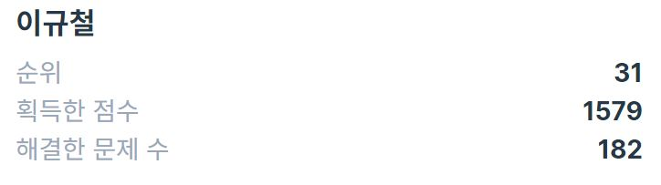

# Improving skills of Algorithm & Data Structure
## `To keep consistent solving problems!`

## Solving Languages : C++, Java, Python

### 월별 알고리즘 풀이 소스 기록하기  
- 4월 : Python 기초, Pytorch 입문
- 5월 : Pytorch 활용 딥러닝 예제 (이미지 분류, 적대적 생성)
- 6월 : Python 기초 알고리즘 (백준)
- 7월 : Python 문법 활용, 기초/중급 난이도 알고리즘 풀이 with C++, Java
- 8월 : 중급 난이도 알고리즘 풀이 (C++, Java, Python)
- 9월 : 알고리즘 인강 학습, 실습 (C++, Java, Python)

### 각 풀이 문제마다 포함해야 될 내용들  
- 문제 링크 : 문제 식별 번호 및 문제를 채점 가능한 링크
- 날짜 : 언제 풀었는지?
- 문제 유형 : DFS, DP, BFS, 그래프, Greedy 등 문제 유형 (복합 문제는 경우 DFS+DP처럼 표시)
- 시간 복잡도 : 소스 코드의 시간 복잡도 빅오 표기법으로 표기 (시간 복잡도를 분석할 줄 모르면 안됨!)
- 주석 : 어떤 알고리즘과 자료구조를 적용 했는지를 적고, 각 구문(if, for 등)마다 논리 간단 설명
